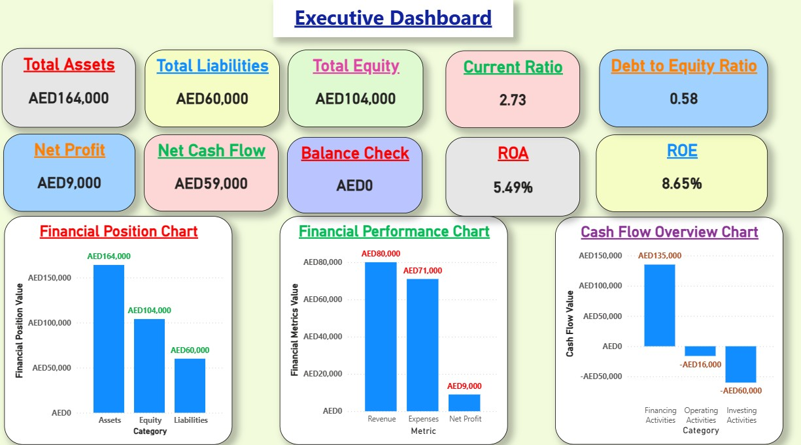
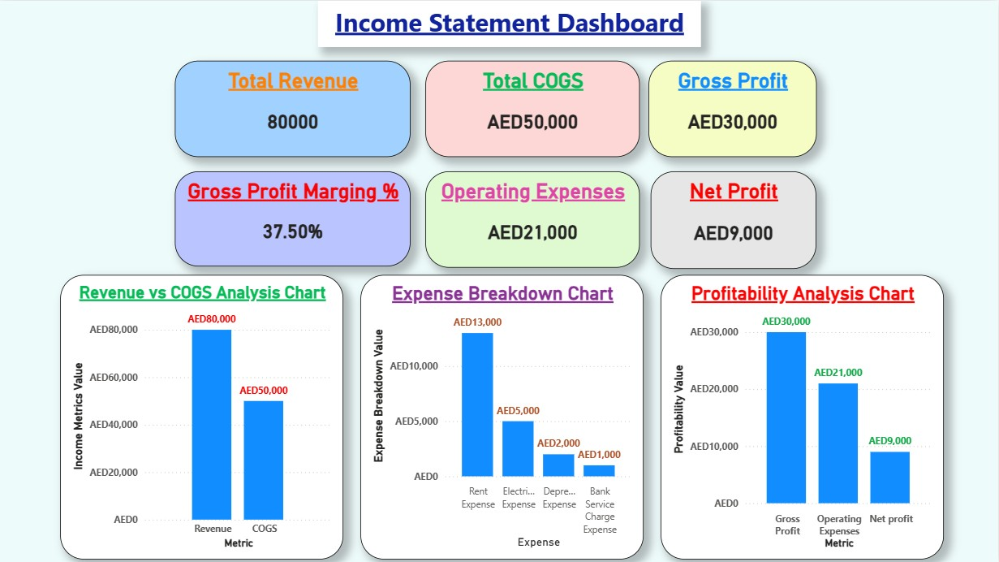
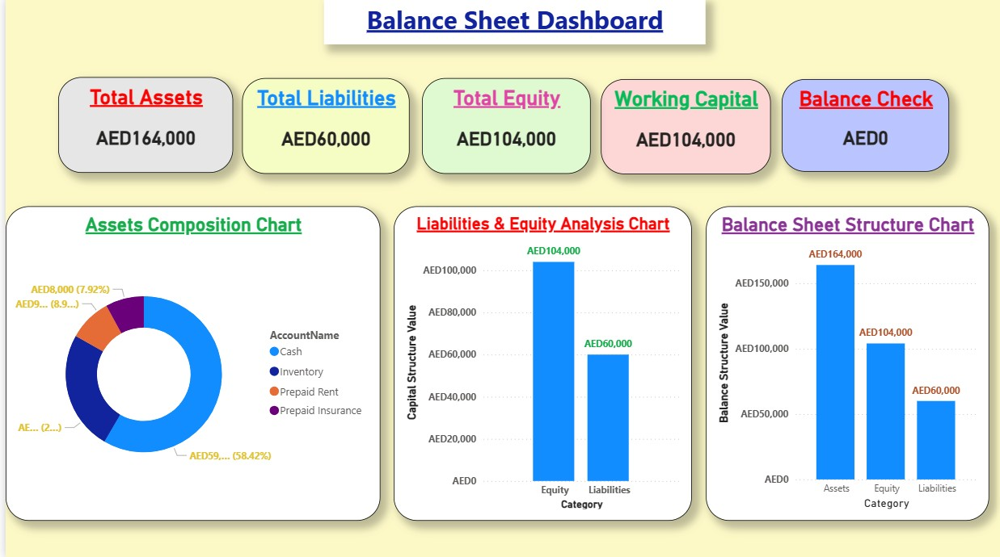
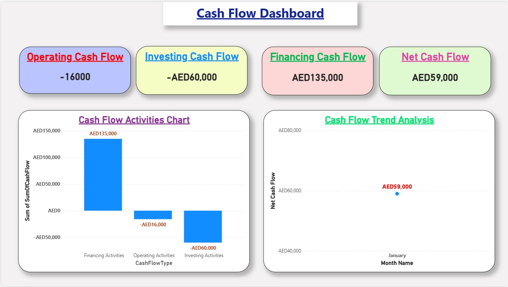
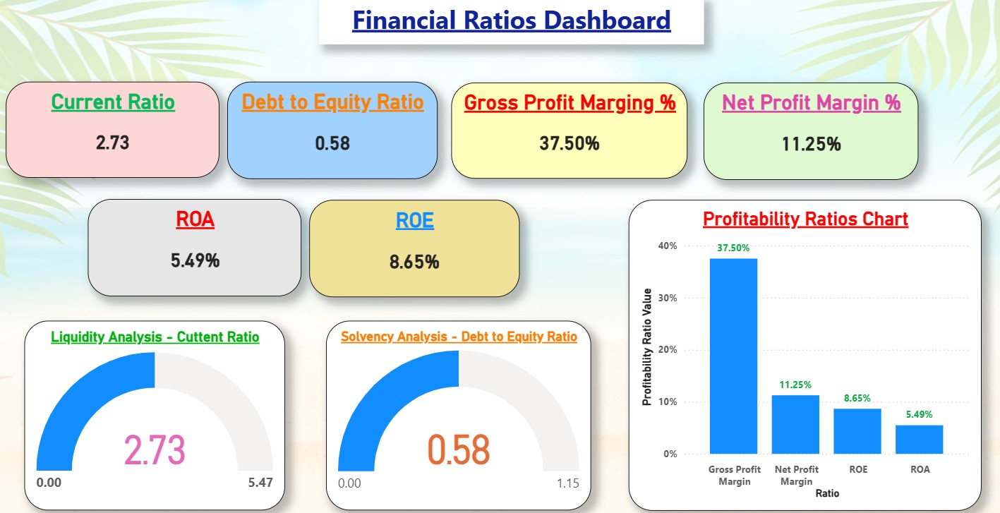

📊 Accounting Financial Analysis Dashboard

## Project Overview

An interactive Power BI Financial Analysis Dashboard connected with a Microsoft Access database to analyze business financial performance, financial position, cash flow, and financial ratios.

The project transforms accounting transactions into meaningful financial insights using data modeling, DAX calculations, and interactive visualizations.

## Business Problem

Businesses need accurate financial reporting and analysis to monitor:

- Revenue performance
- Cost of Goods Sold (COGS)
- Expenses
- Profitability
- Financial Position
- Cash Flow Movement
- Liquidity and Solvency

This dashboard provides management with a clear view of financial performance and supports data-driven decision making.

## Data Source

Microsoft Access Database containing:

- Chart of Accounts
- Journal Entries
- General Ledger Analysis
- Cash Flow Statement Query

The accounting data was prepared, structured, and connected to Power BI for analysis.

## Tools Used

- Microsoft Power BI
- DAX
- Microsoft Access
- Excel
- Power Query
- Data Modeling
- Financial Analysis Techniques
- AI Tools

# Dashboard Pages

## 1. Executive Financial Dashboard

Provides a high-level overview of company financial performance.

### KPIs:

- Total Assets
- Total Liabilities
- Total Equity
- Net Profit
- Net Cash Flow
- Current Ratio
- ROA
- ROE
- Balance Check

### Analysis:

- Financial Position Analysis
- Financial Performance Analysis
- Cash Flow Overview

## 2. Income Statement Dashboard

Analyzes company profitability.

### Visualizations:

- Revenue vs COGS Analysis
- Expense Breakdown Analysis
- Profitability Analysis

### KPIs:

- Total Revenue
- Total COGS
- Gross Profit
- Gross Profit Margin
- Operating Expenses
- Net Profit

## 3. Balance Sheet Dashboard

Analyzes financial position.

### Visualizations:

- Assets Composition Analysis
- Liabilities & Equity Analysis
- Balance Sheet Structure

### KPIs:

- Total Assets
- Total Liabilities
- Total Equity
- Working Capital

## 4. Cash Flow Dashboard

Analyzes cash movement from different activities.

### KPIs:

- Operating Cash Flow
- Investing Cash Flow
- Financing Cash Flow
- Net Cash Flow

### Visualizations:

- Cash Flow Activities Chart
- Cash Flow Trend Analysis

## 5. Financial Ratios Dashboard

Analyzes financial health indicators.

### Liquidity Analysis:

- Current Ratio

### Solvency Analysis:

- Debt to Equity Ratio

### Profitability Analysis:

- Gross Profit Margin %
- Net Profit Margin %
- Return on Assets (ROA)
- Return on Equity (ROE)

# Key Financial Results

## Financial Position

- Total Assets: 164,000
- Total Liabilities: 60,000
- Total Equity: 104,000

## Profitability

- Revenue: 80,000
- COGS: 50,000
- Gross Profit: 30,000
- Operating Expenses: 21,000
- Net Profit: 9,000

## Cash Flow

- Operating Activities: -16,000
- Investing Activities: -60,000
- Financing Activities: 135,000
- Net Cash Flow: 59,000

## Financial Ratios

- Current Ratio: 2.73
- Debt to Equity Ratio: 0.58
- Gross Profit Margin: 37.50%
- Net Profit Margin: 11.25%
- ROA: 5.49%
- ROE: 8.65%

# Project Screenshots

## Executive Dashboard

## Income Statement Dashboard

## Balance Sheet Dashboard

## Cash Flow Dashboard

## Financial Ratios Dashboard

# Future Improvements

- Add more monthly financial transactions
- Expand financial trend analysis
- Add forecasting models using AI
- Automate reporting process
- Connect with SQL Database

# Author

Mostafa Hisham Abdelghani

Accounting & Data Analysis Projects

Skills:
Power BI | DAX | Excel | Access | SQL | Power Query | Financial Analysis
